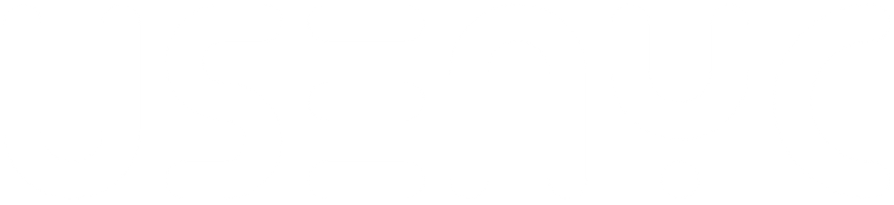

#  Portifolio USENYC

#### A Usenyc é uma empresa fictícia criada para fins educacionais no curso de Desenvolvimento de Software. Nosso propósito é simular uma empresa moderna de Inteligência Artificial e Automação, mostrando como tecnologias avançadas podem otimizar processos e melhorar resultados em ambientes reais.


<p align="center">
    
</p>

<p align="center">
  
  
  
</p>
<br>


## **O Que Fazemos?**

- Automatizamos tarefas repetitivas.

- Aceleramos o desenvolvimento com ferramentas inteligentes.

- Organizamos fluxos de trabalho para aumentar produtividade.

- Oferecemos suporte estratégico com insights baseados em IA.
<br>


## **Nosso Objetivo:**

Entregar soluções claras, rápidas e eficientes, representando como uma empresa tech atua na prática: com inovação, precisão e foco em resultados.
<br>


## **Porque a Usenyc existe?**

- Falta de produtividade

- Tarefas repetitivas

- Informações desorganizadas

- Falta de integração entre sistemas

- Decisões lentas


A empresa foi criada para simular um ambiente corporativo de tecnologia, permitindo que os participantes vivenciem na prática como funciona a colaboração em equipe, a divisão de papéis, o uso de metodologias ágeis e o desenvolvimento de um projeto real. A Usenyc funciona como um laboratório de aprendizado, onde teoria e prática se encontram para formar profissionais mais preparados e completos.
<br>


## **Quais Problemas Resolvemos:**

- Falta de produtividade

- Tarefas repetitivas

- Informações desorganizadas

- Falta de integração entre sistemas

- Decisões lentas

- Retrabalho no desenvolvimento
<br>


## **📁 Estrutura do Projeto**

```plaintext
/
├── app/
│   └── main.py                 # Backend principal (lógica da aplicação)
│
├── assets/                     # Imagens e elementos gráficos
│   ├── analytics.png
│   ├── circle1.png
│   ├── circle2.png
│   ├── code.png
│   ├── elemento1.png
│   ├── elemento2.png
│   ├── elemento3.png
│   ├── equipe.png
│   ├── footer.png
│   ├── fundo_3.png
│   ├── fundo1.png
│   ├── fundo1v.png
│   ├── games.png
│   ├── github.png
│   ├── instagram.png
│   ├── linkedin.png
│   └── usenycname.png
│
├── public/
│   └── index.html              # Página inicial
│
├── script/
│   ├── home.js                 # Scripts da interface
│   └── services/
│       └── api.py              # Integrações e requisições
│
├── styles/
│   └── home.css                # Estilos da página
│
├── package.json                # Dependências do projeto
├── requirements.txt            # Dependências Python
└── README.md                   # Documentação do projeto
```


## 💻 **Tecnologias Utilizadas**

O site foi construído com tecnologias simples, rápidas e eficientes:

- HTML5 – estrutura da página


- CSS3 – estilização e identidade visual

- JavaScript – interatividade e comportamento dinâmico da interface
<br>


## 🎯 **Funcionalidades do Site**

- Layout moderno e responsivo

- Design baseado em cores que reforçam confiança, criatividade e profissionalismo

- Navegação simples e intuitiva

- Seções dedicadas a equipe, serviços e apresentação institucional

- Estrutura organizada para futuras expansões
<br>


# **Equipe e Contribuidores**

<br>
<br>
<p align="center">
  <a href="https://github.com/DEVdamas97">
    
  </a>
  <a href="https://github.com/vizwoxs">
    
  </a>
  <a href="https://github.com/Felip3CA">
    
  </a>
  <a href="https://github.com/jacke9409">
    
  </a>
</p>
<br>
<br>

# <span style="color:#fbbf24;">**Right-arm em suas estrátegias.**</span>
